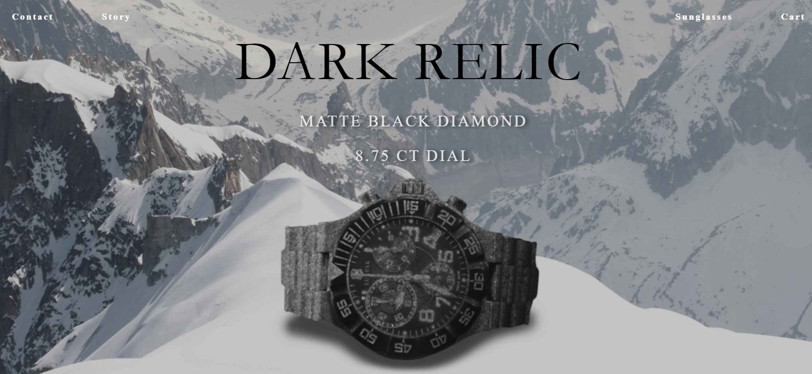

# Lu Var   
**Stack:** *HTML, CSS, Javascript*

**Data Finished:** 11/26/2021

#### **Objective 📈:** **Create a professional website from scratch using your own assets**

**Requirements** 🚦

• *Must be a 3 page website*

• *Must create products from scratch*

• *Must have a functional cart (calculator)*

&nbsp;

**⚖️What's the most technically challenging part of this project and why?⚖️**

&emsp; &emsp;Design was the most challenging aspect of the entire project. I didn’t realize this until I started making the cart calculator 
and had trouble integrating data from modals. I realized this when was able to finish responsive design faster in certain sections. 

&emsp; &emsp;The underlying issue was making my design without considering mobile devices. This led to a lot of time being wasted and me having to readjust the code more often. In addition, I rewrote a lot of sections because I didn’t use one stylesheet or one javascript file. If I had spent more time designing, I could have finished quicker. 

&nbsp;

# Realizations ⌛️

• Backups Matter | Using git or other version control is a necessity. I was constantly saving code through text files and debugging through this approach. In the long run, this isn't scalable because. Not only is saving code for online access important but implementing different features requires backups.

• Design matters | The simpler the design, the easier it is to maintain

• Classes matter | While obvious, I could have leveraged classes better to avoid writing more code. There were different sections that looked somewhat similar but could have all been shared by a class. 

• Formatting matters | I wasted a lot of time making my code neat when I could have spent less than 5 minutes cleaning up and indenting my code with a VS extension. 

&nbsp;

# Problems 😎

### Major

• **(1)  Products Not Updating in prodDesc Modal**

&emsp; &emsp;A user would choose  a gray button to change the product section and it wouldn’t refresh. This led to the productView messing up.

🔑 *Too much delegation leads to different processes overriding previous functions. I had to erase previous functions and simplify the code to work in fewer areas.*

&nbsp;

• **(2) Incorrect Cart Total**

&emsp; &emsp;The problem was how I updated the total. When products are added through the checkout cart, they aren't registered to the outer buttons 
that add products through the homepage. When a new product is pressed, the total starts from the last time the user pressed the product through the homepage.  

🔑*Updating and using the same variable for add/delete buttons and regular buttons fixed the issue. This caused many headaches*

&nbsp;

• **(3) Making the Sidebar Stop**

&emsp; &emsp;Making a moving sidebar was just trial and error for me. Making the sidebar stop was the challenge. I couldn't find a property that forced the sidebar to pause in it's sticky state. 

🔑*Changing the sidebar’s position type through JS allows it to stop.*

&nbsp;

• **(4) Making the Sidebar Go Back Up**

&emsp; &emsp;After I figured out how to stop the sidebar, it wouldn't return up because of it's changed position.  

🔑*For a stop and return, I used an element’s coordinates instead of scrollY. ScrollY differs on different devices because of device height but using .getBoundingClientRect() on an element will always adjust the needed stop point to send the sidebar up or to stop.*

&nbsp;

• **(5) Creating Wrappers for Dynamic Elements**

&emsp; &emsp; When creating new product boxes for the checkout section, div's had no wrappers. I tried using an incrementing count that would update when a product boxe was created but it didn't work. It failed because the updated count couldn’t be accessed while created. 
 
🔑*Solutions*

> (1): 
    testTextBox.parentNode.insertBefore(testBox, testTextBox);

    testBox.appendChild(testTextBox);

> (2):  
    testBox.before(testTextBox);

    testBox.appendChild(testTextBox);

&nbsp;  

• **(NA) Retrieving Data from Products**

&emsp; &emsp; I had difficulty adding a product description section because my webpages are static. To be efficient, 
I have to be using a server to retrieve product information. While I know SQL, I'd have to learn PHP and that would have to drag this project out. I also wanted to keep this project vanilla (HTML, CSS, JS). 

🔑*I settled for modals. However, this forced me to use (parentElement.firstElementChild) frequently*

&nbsp;

&nbsp;

### Minor

• **Sidebar breaking**

&emsp; &emsp; This was a minor problem with major consequences. Since I used position sticky for the sidebar, it broke when paired 
with overflow-x:hiddenon the body and html. 

🔑 *Removing the overflow-x:hidden and just placing it in the body tagged fixed my problem*

&nbsp;

• **Display: block makes a href button responsive but breaks layout**

🔑 *Absolute positioning is needed with Display: Block.*
&nbsp;

• **The footer breaks layout because it's not included in grid**

• **CSS grids will create column automatically if auto columns is not specified**

• **The window.onclick doesn't work for multiple modals**

• **Clip is inherited (included) in pseudo element**

&nbsp;

&nbsp;

*📚 Disclaimer:*

I was inspired by these watch/sunglass brands: *Vincero, Rolex, Omega, and Ray-Ban*

My products are *recreations* of existing assets from Vincero and Ray-Ban. All original designs that I used are included in a 
folder within this project. I *do not claim to own* these assets. Everything done is for educational purposes 
and no money is being generated through this site. *All rights to these original assets lie with Vincero and Ray-Ban* 
